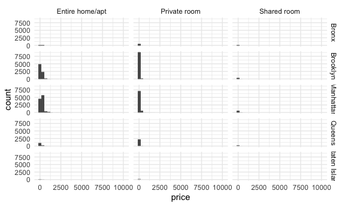
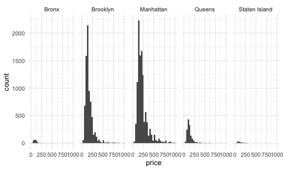
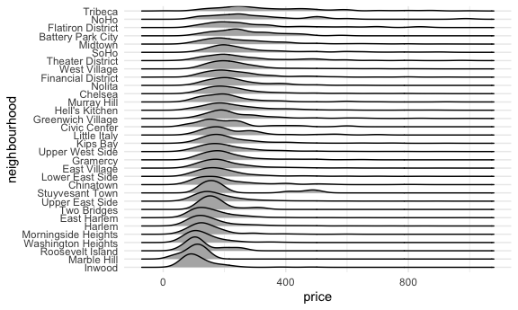

Case Study
================

# Get the data

``` r
library(p8105.datasets)
library(ggplot2)

data(nyc_airbnb)

nyc_airbnb = nyc_airbnb |>
  rename(borough = neighbourhood_group) |>
  mutate(stars = review_scores_location / 2)
```

## Brainstorm questions

- Where are AirBNBs expensive?
  - Borough? Neighborhood?
  - Do other factors (room type) affect price? What about rating?
- How long are AirBNBs active?
  - Are AirBNBs illegal and do they get shut down?
- Which units have the most availability?
- How is review score impacted by location?
- How many apts are run by one host?
  - Does that affect price?
  - Does that vary by neighborhood?
- Where are AirBNBs?
  - Borough? Neighborhood?
  - Lat and long?

## Attempt solutions

``` r
nyc_airbnb |>
  count(borough)
```

    ## # A tibble: 5 × 2
    ##   borough           n
    ##   <chr>         <int>
    ## 1 Bronx           649
    ## 2 Brooklyn      16810
    ## 3 Manhattan     19212
    ## 4 Queens         3821
    ## 5 Staten Island   261

``` r
nyc_airbnb |>
  group_by(borough, room_type) |>
  summarize(mean_price = mean(price)) |>
  pivot_wider(
    names_from = room_type,
    values_from = mean_price
  )
```

    ## `summarise()` has grouped output by 'borough'. You can override using the
    ## `.groups` argument.

    ## # A tibble: 5 × 4
    ## # Groups:   borough [5]
    ##   borough       `Entire home/apt` `Private room` `Shared room`
    ##   <chr>                     <dbl>          <dbl>         <dbl>
    ## 1 Bronx                      125.           65.5          57.5
    ## 2 Brooklyn                   175.           76.7          59.6
    ## 3 Manhattan                  238.          107.           84.7
    ## 4 Queens                     140.           70.6          49.1
    ## 5 Staten Island              207.           65.4          25

``` r
nyc_airbnb |>
  ggplot(aes(x = price)) +
  geom_histogram() +
  facet_grid(borough ~ room_type)
```

    ## `stat_bin()` using `bins = 30`. Pick better value with `binwidth`.



``` r
nyc_airbnb |>
  filter(price >= 9500)
```

    ## # A tibble: 6 × 18
    ##         id review_scores_location name   host_id host_name borough neighbourhood
    ##      <dbl>                  <dbl> <chr>    <dbl> <chr>     <chr>   <chr>        
    ## 1  3103784                     10 A Pri…  9.83e6 Michael   Brookl… Brooklyn Hei…
    ## 2  4737930                      8 Spani…  1.24e6 Olson     Manhat… East Harlem  
    ## 3   187529                     NA $3200…  9.02e5 Georgia   Manhat… Lower East S…
    ## 4  9528920                      9 Quiet…  3.91e6 Amy       Manhat… Lower East S…
    ## 5 16429718                     NA Charm…  1.36e7 Lena      Brookl… Sheepshead B…
    ## 6 12955683                      8 Great…  3.57e7 Duan      Manhat… Upper West S…
    ## # ℹ 11 more variables: lat <dbl>, long <dbl>, room_type <chr>, price <dbl>,
    ## #   minimum_nights <dbl>, number_of_reviews <dbl>, last_review <date>,
    ## #   reviews_per_month <dbl>, calculated_host_listings_count <dbl>,
    ## #   availability_365 <dbl>, stars <dbl>

``` r
nyc_airbnb |>
  filter(price < 1000, room_type == "Entire home/apt") |>
  ggplot(aes(x = price)) +
  geom_histogram() +
  facet_grid(. ~ borough)
```

    ## `stat_bin()` using `bins = 30`. Pick better value with `binwidth`.



``` r
nyc_airbnb |>
  filter(
    price < 1000,
    room_type == "Entire home/apt",
    borough == "Manhattan") |>
  group_by(neighbourhood) |>
  summarize(
    n_apt = n(),
    mean_price = mean(price)) |>
  arrange((mean_price))
```

    ## # A tibble: 32 × 3
    ##    neighbourhood       n_apt mean_price
    ##    <chr>               <int>      <dbl>
    ##  1 Marble Hill             6       101.
    ##  2 Inwood                 88       119.
    ##  3 Roosevelt Island        8       131.
    ##  4 Washington Heights    260       133.
    ##  5 Morningside Heights   157       151.
    ##  6 East Harlem           431       163.
    ##  7 Harlem                964       164.
    ##  8 Two Bridges            21       174.
    ##  9 Upper East Side      1001       193.
    ## 10 Lower East Side       522       205.
    ## # ℹ 22 more rows

``` r
nyc_airbnb |>
  filter(
    price < 1000,
    room_type == "Entire home/apt",
    borough == "Manhattan") |>
  mutate(neighbourhood = fct_reorder(neighbourhood, price)) |>
  ggplot(aes(x = price, y = neighbourhood)) +
  geom_density_ridges()
```

    ## Picking joint bandwidth of 26.6


